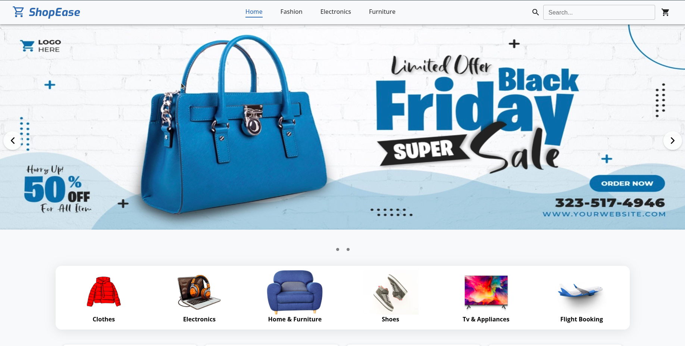
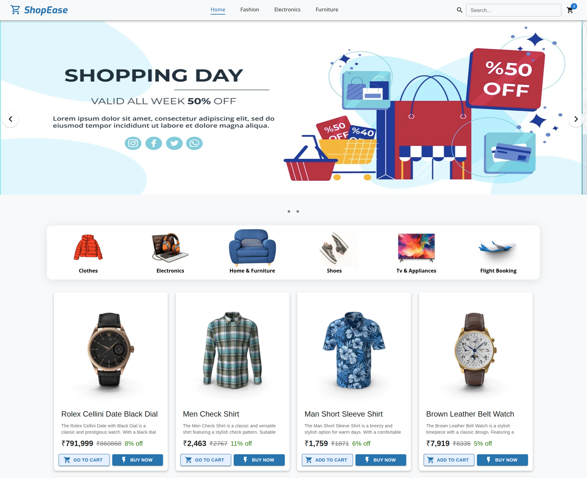
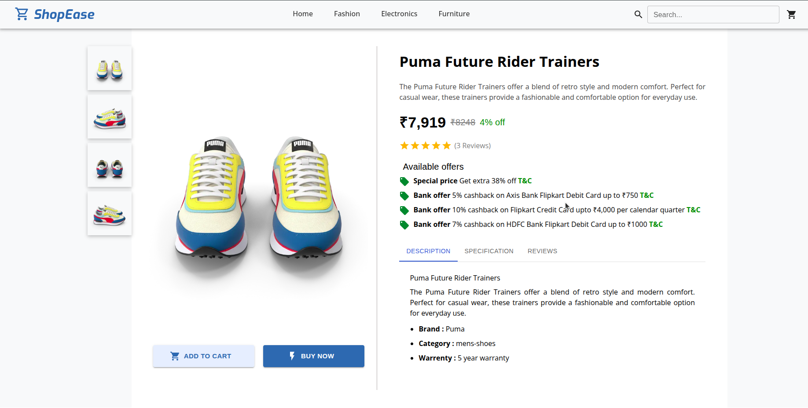
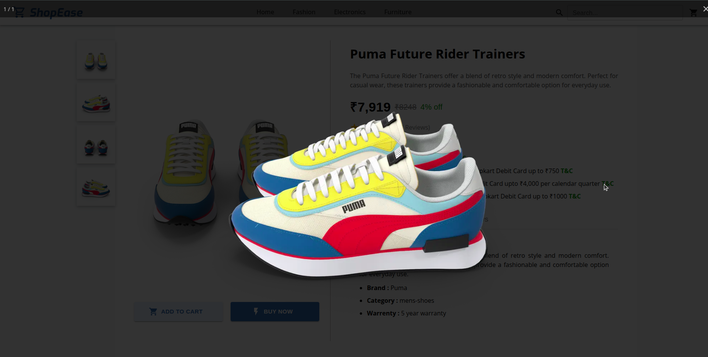
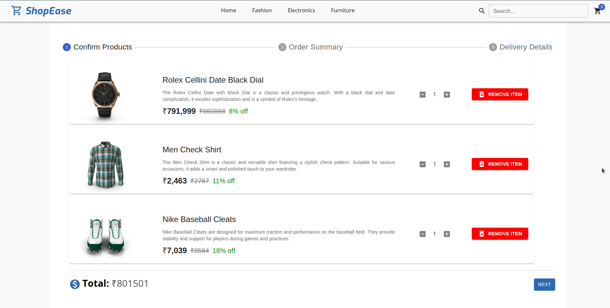
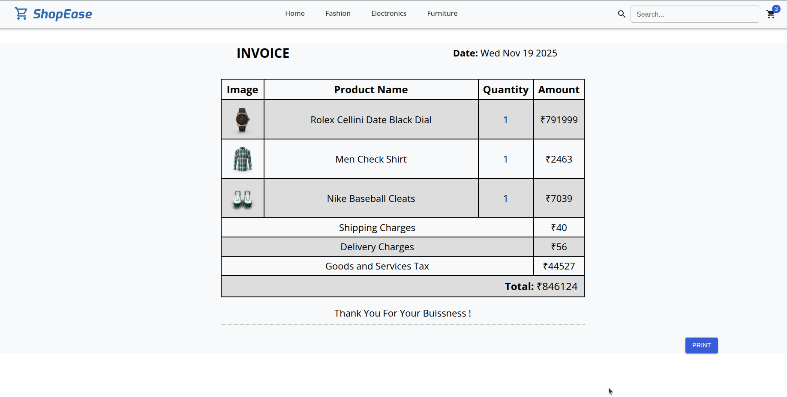
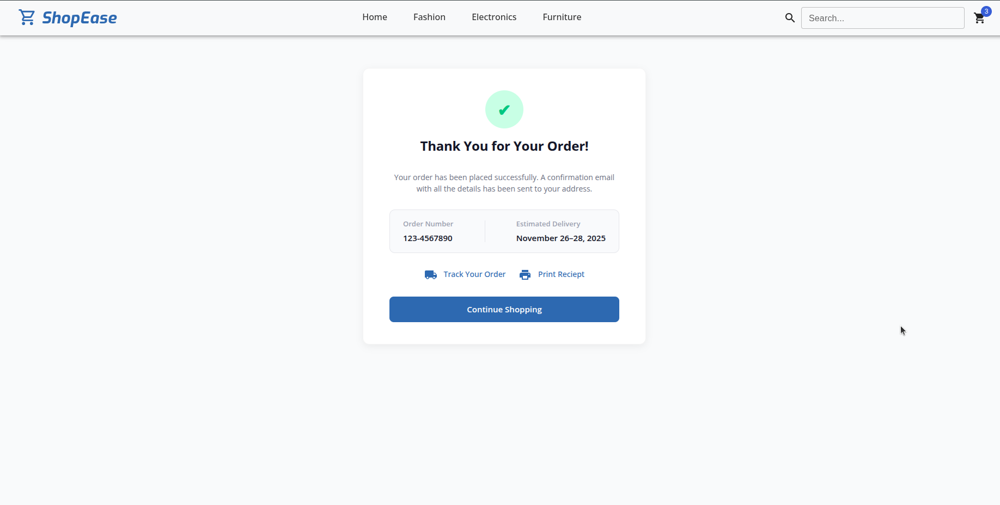

# 🛒 ShopeEase | Ecommerce Web App - [(Link)](https://shope-ease-nu.vercel.app/)

ShopeEase is an E-commerce web application built using **React**, **Redux Toolkit**, and **Vite**. It provides a clean UI, product browsing, cart management, and a modular structure suitable for scaling into a full-featured shopping platform.



## 📖 Table of Contents
- [Introduction](#-introduction)
- [Features](#-features)
- [Project Structure](#-project-structure)
- [Tech Stack](#-tech-stack)
- [Installation](#️-installation)
- [API](#-api)
- [Screenshots](#screenshots)
- [License](#-license)

## 📝 Introduction
ShopeEase is Modern, Responsive online Ecommerce store where users can browse, search products(Clothes, Electronics, Furniture) and manage a shopping cart.

## ✨ Features
- Product listing and filtering
- Add/remove/update cart
- Global Redux state
- Search Products
- Mock API data
- Reciept generation
- Mock Payment

## 📂 Project Structure

```plaintext
ShopeEase/
├── index.html
├── eslint.config.js
├── package.json
├── vite.config.js
├── public/
├── src/
│   ├── App.jsx
│   ├── App.css
│   ├── main.jsx
│   ├── assets/
│   ├── components/
│   │   ├── Navbar.jsx
│   │   ├── Footer.jsx
│   │   ├── ProductList.jsx
│   │   ├── Cart.jsx
│   │   ├── ProductCard.jsx
│   │   └── ...
│   ├── data/
│   │   └── data.js
│   ├── features/
│   │   └── products/
│   │       ├── ProductSlice.js
│   │       └── cart/
│   │           └── CartSlice.js
│   └── store/
│       └── store.js
```

## 🧰 Tech Stack
- [React.js](https://react.dev/learn)
- [Material UI (MUI)](https://mui.com/)
- [Redux Toolkit](https://redux-toolkit.js.org/)
- [react-to-print (Library)](https://www.npmjs.com/package/react-to-print)
- [react-photo-view (Library)](https://www.npmjs.com/package/react-photo-view)
- [Vanilla CSS](https://developer.mozilla.org/en-US/docs/Web/CSS)

## ⚙️ Installation

```
git clone git@github.com:patilOm1680/ShopeEase.git
```
```
cd ShopeEase
```

```
npm install
```

```
npm run dev
```


## 🔌 API
Uses Dummy API- https://dummyjson.com/products?limit=100

## Screenshots









## 📄 License
No license right now.

